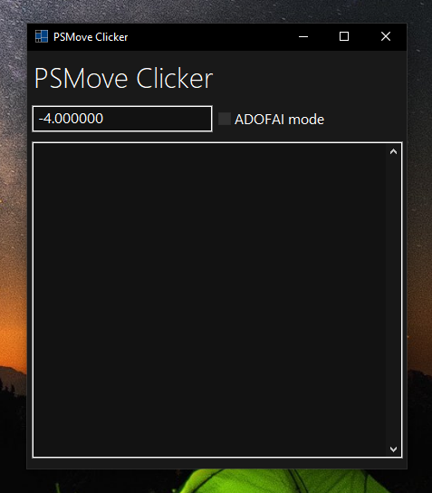

# PSMove-Clicker

## REPOSITORY ARCHIVED

Use [PSMoveClicker-electron](https://github.com/Nadwey/PSMoveClicker-electron) instead



This program was primarly made for ADOFAI, but you can use it as a mouse.

Btw I'm not responsible for breaking your PSMove (it shouldn't happen as long as you keep force above -10)  
Also, don't set the force to 0... Bad things will happen

## How do I use it?

I recommend using [PSMoveServiceEx](https://github.com/Timocop/PSMoveServiceEx/) instead of [PSMoveService](https://github.com/psmoveservice/PSMoveService), but you can also use it.

Run PSMoveService first, then PSMove Clicker.  
If  the program doesn't start, it means that it can't connect to PSMoveService  
You also need to have [VC Redist](https://docs.microsoft.com/en-us/cpp/windows/latest-supported-vc-redist) installed

Buttons:

- Cross button - Left Mouse Button - supports holding  
- Circle button - Right Mouse Button - supports holding  
- Select button - Escape Button - supports holding  
- T button - Mouse cursor
- PS Button - Sets main controller in ADOFAI mode

Control panel:

- Textbox with -4.000000 - force of the swing
- ADOFAI mode - Fixes multiple clicks at once in ADOFAI (presses keyboard keys) (main controller (will light up) presses mouse)

## How do I click?

Swing.

## Does it work with Geometry Dash?

Only Cube game mode and also there's a delay  
~~You can always play with the cross button~~

## How to build (MSVC)

Notice: This "tutorial" is not tested

### Step 1

Install [gammasoft71/xtd](https://github.com/gammasoft71/xtd) and add it to this project:  

- go to project root dir, and run `xtdc build`, ignore the errors

### Step 2

Paste the lib file from [there](PSMoveClient_CAPI-Binaries.zip) somewhere (for example to `build/` directory) and also the dll file to your exe folder  
Or build PSMoveService yourself  
Or download build of PSMoveService, then generate .lib definition file

It should look like this:

```text
root
└───build
    └───PSMove_Clicker
        └───Release (or debug)
                PSMoveClient_CAPI.dll
```

Add the lib file to linker (`Project settings > Configuration Properties > Linker > Input > Additional Dependencies`)  
for example: `$(SolutionDir)PSMoveClient_CAPI.lib`

### Step 3

Open build/PSMove_Clicker.sln

Right click on PSMove_Clicker in the solution explorer and click `Set as Startup project`

## How to build (Other compilers)

### Step 1

Good luck

## Licence

MIT
